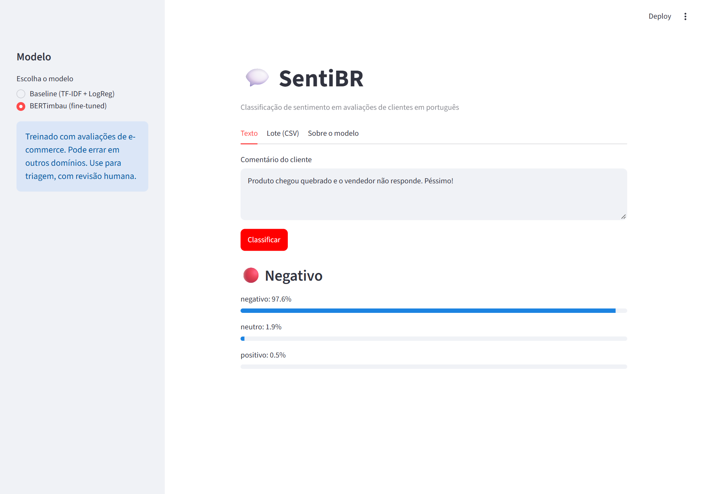
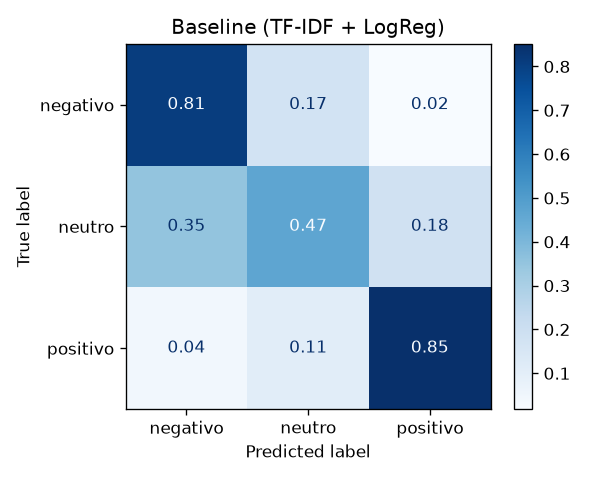
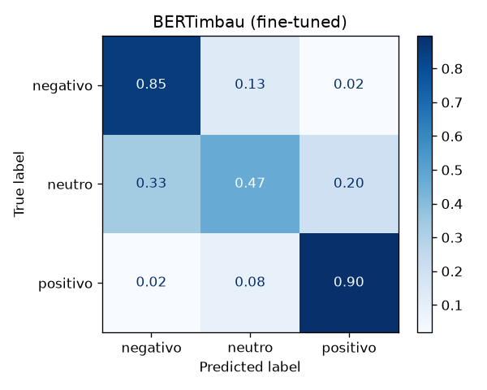

# 💬 SentiBR — classificação de sentimento em avaliações de clientes em português

[](https://github.com/rodrigogduca/sentibr/actions/workflows/ci.yml)
[](https://www.python.org/downloads/)
[](LICENSE)

Classifica comentários de clientes em **negativo, neutro ou positivo**, com a probabilidade de cada classe,
para triar reclamações e medir satisfação. Compara uma abordagem clássica (**TF-IDF + Regressão
Logística**) com um transformer ajustado (**BERTimbau**), medindo o ganho e o custo de cada um.

> Projeto desenvolvido por **Rodrigo Gandarela Soares de Farias Duca** (Engenharia de Computação —
> Universidade SENAI CIMATEC), set/2026. Temáticas: **Processamento de Linguagem Natural e Deep Learning
> (transformers)**. Especificação completa (Spec-Driven Development + CRISP-DM) em [`specs/`](specs/).
>
> 📖 **Documentação técnica detalhada, passo a passo:** [`DOCUMENTACAO.md`](DOCUMENTACAO.md)



## Resultado

Conjunto de teste com 5.464 comentários, nunca usado para treino nem para escolha de hiperparâmetros.
Métrica principal: **F1-macro**, porque as classes são desbalanceadas (neutro = 9%).

| Modelo | F1-macro ↑ | Acurácia | F1 neg. | F1 neutro | F1 pos. | Latência CPU |
|--------|-----------:|---------:|--------:|----------:|--------:|-------------:|
| Classe majoritária (piso) | 0,256 | 0,624 | 0,00 | 0,00 | 0,77 | — |
| TF-IDF + LogReg, **baseline** | 0,682 | 0,806 | 0,81 | 0,34 | 0,90 | 1,6 ms |
| BERTimbau sem pesos (ablação) | 0,674 | **0,866** | 0,86 | 0,23 | **0,94** | — |
| **BERTimbau com pesos de classe** | **0,721** | 0,847 | 0,85 | **0,38** | 0,93 | 73 ms |

- **O BERTimbau supera o baseline em +0,039 de F1-macro**, acima da meta de +0,03 definida antes dos
  experimentos. O custo é uma inferência ~47× mais lenta, ainda bem abaixo do limite de 1 s por texto.
- **A ablação mostra por que a ponderação importa.** Sem pesos, o BERT tem a maior acurácia, mas o
  recall do neutro cai para 0,17: o modelo aprende a ignorar a classe rara, e o F1-macro fica *abaixo*
  do baseline. Com cross-entropy ponderada, o recall do neutro sobe para 0,47.
- **O neutro é o limite do problema.** 88% dos erros analisados envolvem essa classe, e boa parte é
  comentário misto ou rótulo ruidoso. Veja a [análise de erros](reports/erros.md).

| Baseline | BERTimbau |
|---|---|
|  |  |

## Como funciona

```
Olist (Kaggle, 99 mil avaliações)
   │  src/dados.py: título+mensagem → limpeza → nota→classe → deduplicação → split 70/15/15 estratificado
   ▼
treino / validação / teste (seed 42, sem textos em comum — verificado por assert e teste)
   │
   ├─► src/baseline.py      TF-IDF (1–2 gramas) + LogReg balanceada, GridSearchCV (só no treino)
   ├─► src/treinar_bert.py  fine-tuning do BERTimbau, 2 épocas, cross-entropy ponderada
   ▼
src/avaliar.py  → mesmo teste para todos: métricas, matrizes de confusão, latência, amostra de erros
   ▼
app/app.py (Streamlit) → texto único · lote CSV com download · métricas do modelo
```

Decisões técnicas:
- **Rótulo derivado da nota:** 1–2 = negativo, 3 = neutro, 4–5 = positivo. É supervisão fraca: a nota
  nem sempre bate com o texto, e isso impõe um teto à métrica (ver `reports/erros.md`).
- **Deduplicação antes do split**, para que um texto repetido ("Ótimo produto") não apareça no treino e
  no teste e infle a métrica.
- **Negações preservadas** quando se testa a remoção de stopwords ("não gostei" ≠ "gostei").
- **Pesos de classe** (inverso da frequência) no baseline e no BERT, para compensar o desbalanceamento.
- **Interface comum de inferência** (`src/inferencia.py`): os dois modelos expõem
  `prever(textos) → [{"negativo": p, "neutro": p, "positivo": p}]`, e o app não depende de qual está ativo.

## Dados

[Brazilian E-Commerce Public Dataset by Olist](https://www.kaggle.com/datasets/olistbr/brazilian-ecommerce),
licença **CC BY-NC-SA 4.0**. Avaliações reais e anonimizadas de 2016–2018. Os dados não são versionados:
`src/dados.py` baixa o arquivo pelo `kagglehub`.

| Etapa | Linhas |
|-------|-------:|
| Bruto | 99.224 |
| Com texto (≥ 3 caracteres) | 42.377 |
| Após deduplicação | 36.422 |
| Treino / validação / teste | 25.495 / 5.463 / 5.464 |

## Como rodar

Requer Python 3.11+. O BERTimbau precisa de GPU para treinar em tempo razoável (~10 min numa RTX 3050
de 6 GB; ~20 min numa T4 do Colab). O baseline roda em qualquer CPU.

```bash
git clone https://github.com/rodrigogduca/sentibr.git && cd sentibr
python -m venv .venv && .venv\Scripts\activate          # Linux/macOS: source .venv/bin/activate
pip install -r requirements.txt                           # GPU: antes, pip install torch --index-url https://download.pytorch.org/whl/cu124

python -m src.dados          # baixa o Olist (requer login no Kaggle) e gera data/processed/
python -m src.eda            # gráficos exploratórios em reports/figuras/
python -m src.baseline       # treina o baseline → models/baseline.joblib
python -m src.treinar_bert   # fine-tuning → models/bertimbau/  (opcional; --sem-pesos para a ablação)
python -m src.avaliar        # métricas no teste → reports/metricas.json
streamlit run app/app.py     # interface
pytest && ruff check .       # testes e lint
```

Sem GPU, use o notebook [`notebooks/02_bertimbau_colab.ipynb`](notebooks/02_bertimbau_colab.ipynb).

## Estrutura

```
specs/        especificação: visão, requisitos, dados, design, experimentos, tarefas, entrega
src/          dados, eda, baseline, treinar_bert, inferencia, avaliar
app/          interface Streamlit + CSV de exemplo
tests/        5 testes do pré-processamento (rótulos, limpeza, deduplicação, split sem vazamento)
reports/      métricas, figuras, análise de erros, relatório técnico em PDF
notebooks/    reprodução do fine-tuning no Colab
DOCUMENTACAO.md  guia técnico completo, passo a passo
```

Qualidade: **5 testes** (`pytest`) e lint (`ruff`) rodam a cada push pelo
[CI](.github/workflows/ci.yml), sem precisar de Kaggle nem GPU.

## Limitações e uso responsável

- **Domínio:** treinado em avaliações de e-commerce; pode errar em saúde, política ou redes sociais. O app avisa.
- **Rótulo ruidoso:** em ~25% dos erros analisados a nota contradiz o texto. A métrica subestima o modelo
  nesses casos, e um teste revisado à mão seria a medida mais honesta.
- **Comentários mistos** ("entrega rápida, mas produto ruim") não cabem em uma única etiqueta. A evolução
  natural é a análise de sentimento por aspecto.
- **Viés linguístico:** gírias regionais e erros de digitação estão sub-representados, e o desempenho pode
  variar conforme o autor. Não há dados demográficos para medir isso (o que é correto pela LGPD).
- **Uso previsto:** triagem com revisão humana. O modelo não deve ser usado para decidir sobre pessoas,
  como avaliar ou punir atendentes.

## Referências

- Souza, F.; Nogueira, R.; Lotufo, R. *BERTimbau: Pretrained BERT Models for Brazilian Portuguese.* BRACIS, 2020.
  Modelo: [`neuralmind/bert-base-portuguese-cased`](https://huggingface.co/neuralmind/bert-base-portuguese-cased).
- Olist. *Brazilian E-Commerce Public Dataset*, Kaggle, 2018.
- scikit-learn, Hugging Face Transformers, PyTorch, Streamlit.

## Licença

Código sob [MIT](LICENSE). Os dados não são redistribuídos e mantêm a licença de origem
(Olist, CC BY-NC-SA 4.0); o BERTimbau mantém a licença dos autores originais.
